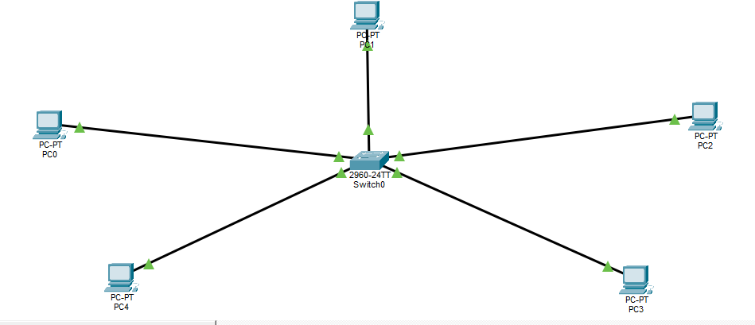

# Lab 4: Custon 5-PC LAN.

## Overview.
This lab project demonstrates a 5-PC Local Area Network (LAN) consisting of five end-user computers connected to a single central switch.

### Tools and components used.
- **Cisco Packet Tracer** (Network Simulation Software)
- 5 x PCs.
- 1 x Switch.
- 5 x Ethernet Copper Straight-Through Cables.

## Network topology.

## IP Address Table.

| Host | Interface |  IP Address   |  Subnet Mask    |   Staus    |
| :--- | :---      |  :---         |  :---           |   :---     |
| PC0  |    Fa0    | `192.168.0.1` | `255.255.255.0` | **Active** |
| PC1  |    Fa0    | `192.168.0.2` | `255.255.255.0` | **Active** |
| PC2  |    Fa0    | `192.168.0.3` | `255.255.255.0` | **Active** |
| PC3  |    Fa0    | `192.168.0.4` | `255.255.255.0` | **Active** |
| PC4  |    Fa0    | `192.168.0.5` | `255.255.255.0` | **Active** |

## Status and Verification.
- I successfully configured the IP Address and subnet mask on all the PCs correctly.
- I used the `ping` command utility, to test connectivity between all the PCs.
- **Results:** The ping test results were successful, proving good network connectivity between the PCs.